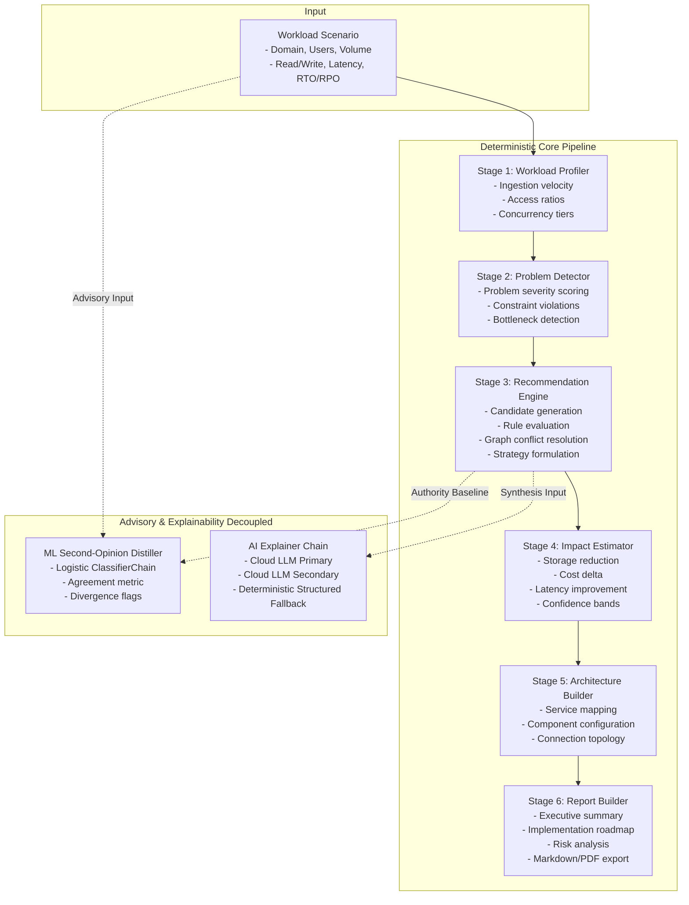

# System Architecture

Technical specification and architectural decision register for the AI Data Architect platform.

---

## 1. End-to-End Pipeline & Dataflow

The system executes a deterministic six-stage pipeline that transforms a structured workload specification into an actionable, fully-traced cloud storage architecture.



### Stage Details

1. **Profiling (`profile_workload`)**: Computes derived workload metrics including daily byte ingestion rate, IOPS distribution across read/write paths, hot versus cold data ratios, concurrency density, and recovery tolerance windows.
2. **Problem Detection (`detect_problems`)**: Maps the workload profile against fourteen discrete operational challenges (for example, `UNBOUNDED_OBJECT_GROWTH`, `HIGH_READ_LATENCY`, `RECOVERY_OBJECTIVE_VIOLATION`, `WRITE_HEADROOM_EXHAUSTION`). Assigns explicit severity rankings (`CRITICAL`, `HIGH`, `MEDIUM`, `LOW`).
3. **Recommendation Engine (`run_recommendation_engine`)**: Discovers candidate techniques from the Knowledge Base catalog. Evaluates preconditions, mutual exclusions, and prerequisite dependencies via a directed graph representation. Derives priority tiers (`REQUIRED`, `RECOMMENDED`, `OPTIONAL`, `AVOID`) and builds alternative strategies (`COST_OPTIMIZED`, `PERFORMANCE_FOCUSED`).
4. **Impact Estimation (`estimate_impact`)**: Applies deterministic regression coefficients calibrated against cloud telemetry to estimate storage reduction (GB and percentage), monthly cost delta (USD), and latency improvement. Integrates percentile confidence bounds (P25 to P75) derived from DuckDB historical queries.
5. **Architecture Building (`ArchitectureBuilder.build`)**: Translates approved techniques and workload constraints into cloud infrastructure components (such as Amazon S3, Amazon RDS PostgreSQL, Amazon ElastiCache Redis, Amazon Redshift, and S3 Glacier). Assigns network topology, replication topologies, and lifecycle policies.
6. **Report Generation (`build_report`)**: Synthesizes the end-to-end evaluation into an executive-ready report comprising a phased implementation roadmap, residual risk register, trade-off matrix, and downloadable Terraform infrastructure scaffolds.

---

## 2. Design Decision Register

### ADR 001: Deterministic Engine Authority vs. Decoupled AI Explanation
* **Context**: LLM outputs are probabilistic and non-reproducible. Production infrastructure choices demand auditability, formal traceability, and deterministic stability across identical inputs.
* **Decision**: All architectural decisions, component selections, prioritization tiers, and quantitative impact projections are computed exclusively by the deterministic rules engine. Generative LLM models operate strictly downstream as read-only synthesizers of human-readable rationale via a two-tier cloud fallback chain.
* **Consequences**: If external AI services encounter API throttling, network timeouts, or complete outages, the system falls back seamlessly to deterministic structured templates (`source="structured"`). Zero decisions or cost numbers are ever delegated to generative model parameters.

### ADR 002: Dual-Track API Exposure & Migration Cutover
* **Context**: The storage schema evolved from schema v1 (flat fields) to schema v2 (hierarchical backup schedules, fine-grained recovery metrics, streaming flags). Breaking existing client contracts during deployment is unacceptable.
* **Decision**: Implement a transparent upconversion seam (`upconvert_v1`). All ingestion endpoints accept both v1 and v2 payloads. The core engine executes strictly on canonical v2 data structures.
* **Cutover Plan**:
  1. Phase 1 (Current): Accept v1 and v2 payloads simultaneously; transparently upconvert v1 inputs at the ingress boundary.
  2. Phase 2: Attach deprecation response headers (`X-API-Deprecation-Warning: schema-v1-retiring`) when v1 structures are submitted.
  3. Phase 3: Transition internal client SDKs to v2 exclusive models; retire v1 conversion layer once telemetry confirms zero v1 traffic.

### ADR 003: Golden-Snapshot Migration Pattern for Knowledge Base Catalog
* **Context**: Adding, editing, or re-weighting storage techniques in `kb/techniques/` risks regressions, such as unexpected technique drops or unintended priority reversals.
* **Decision**: Every knowledge base modification is governed by golden-snapshot tests (`tests/test_golden_scenarios.py`). A suite of reference workloads is evaluated and compared against committed golden outputs.
* **Consequences**: Any change altering technique selection, priority ordering, or impact bounds requires explicit snapshot approval. Graph verification validates that no cyclic dependencies or orphaned prerequisite relationships exist.

### ADR 004: OLTP PostgreSQL vs. OLAP DuckDB Storage Separation
* **Context**: The application handles two distinct data access profiles: high-concurrency transactional metadata operations, and intensive analytical scans across 2,000 multi-dimensional scenario records.
* **Decision**: Split persistence duties between PostgreSQL and DuckDB:
  - **OLTP Path (PostgreSQL with SQLite local fallback)**: Stores client scenario definitions, execution tokens, user preferences, and audit history.
  - **OLAP Path (DuckDB)**: Executes embedded columnar analytics directly over compressed Parquet files (`data/synthetic/scenarios.parquet`). Computes frequency distributions, correlation matrices, multi-technique co-occurrence itemsets, and confidence bands in sub-second query times without external analytics infrastructure.

### ADR 005: ML-as-Second-Opinion Governance & Oversight
* **Context**: An ML distillation model trained on scenario-recommendation pairs can highlight nuanced edge cases, but black-box predictions must never override proven architectural principles.
* **Decision**: The machine learning model (a ClassifierChain of logistic regression models, `ml/model.joblib`) functions strictly in an advisory capacity.
* **Governance Rules**:
  - The deterministic rules engine is the sole source of truth and system authority.
  - The ML model runs concurrently and produces an independent prediction vector.
  - Divergences are categorized into `ml_adds` (techniques ML suggested that engine omitted) and `ml_drops` (techniques engine recommended that ML omitted).
  - All divergences are surfaced in the user interface with top driving workload features for human engineering review. Disagreements never modify the primary architecture output.

---

## 3. Module Map

```
src/storage_advisor/
├── analytics/           Analytical queries, growth simulation, and exploratory data analysis
│   ├── eda.py           DuckDB pure query functions (technique frequency, correlation, co-occurrence)
│   ├── export_parquet.py Parquet partition exporter partitioned by business domain
│   ├── generator.py     Calibrated synthetic scenario generator
│   ├── insights.py      Plotly figure generators for analytical dashboards
│   ├── store.py         Embedded DuckDB analytics repository
│   └── trajectory.py    24-month compound growth simulation and tipping-point engine
├── app/                 FastAPI application service, security, and middleware
│   ├── api.py           REST endpoints, request validation, stage instrumentation
│   └── security.py      API key verification, token-bucket rate limiter, dev gating
├── architecture/        Cloud architecture generation
│   └── builder.py       Maps recommended techniques to AWS components and topologies
├── db/                  Transactional database persistence
│   ├── models.py        SQLAlchemy relational schema definitions
│   └── record.py        Scenario record persistence and retrieval logic
├── detection/           Workload problem detection
│   └── problem_detector.py Rule-based problem detection and severity assignment
├── domain/              Core immutable domain models (Pydantic v2)
│   ├── enums.py         Domain, scale, intensity, and protocol enumerations
│   ├── problems.py      Detected problem definitions and severity rankings
│   ├── recommendations.py Technique recommendation structures and priority bands
│   └── scenario.py      Canonical workload scenario specification and v1 upconversion
├── estimation/          Quantitative impact estimation
│   ├── confidence.py    Percentile confidence band derivation
│   └── impact_estimator.py Storage reduction, cost savings, and latency estimation
├── export/              Infrastructure-as-code and reporting
│   └── terraform.py     Automated HCL Terraform scaffold generation
├── integrations/        External cloud and provider interfaces
│   ├── aws.py           AWS SDK client bindings and credential resolution
│   ├── bedrock.py       Cloud LLM explanation fallback chain (two-tier)
│   └── pricing.py       AWS Pricing API client with regional rate fallback tables
├── kb/                  Knowledge Base v2 catalog engine
│   ├── loader.py        YAML discovery, inheritance merging, and NetworkX graph projection
│   ├── schema.py        Family and variant Pydantic models
│   ├── validate.py      Integrity verification (relationship symmetry, cycle detection)
│   └── techniques/      Hierarchical YAML technique definitions
├── ml/                  Advisory machine learning distillation
│   ├── model.joblib     Trained ClassifierChain model weights
│   ├── features_v2.json Canonical feature schema definition
│   └── second_opinion.py Feature encoder, inference pipeline, and driver feature analysis
├── observability/       Telemetry, logging, and metrics
│   └── metrics.py       In-memory Prometheus metrics collector and exposition formatter
├── profiling/           Workload profile derivation
│   └── workload_profiler.py Pure functions extracting quantitative profile metrics
└── reports/             Consultant report compilation
    ├── builder.py       Structured report payload construction
    └── export.py        Markdown and PDF formatting
```

---

## 4. Test Strategy Summary

The test suite enforces a rigorous multi-tier testing pyramid to guarantee deterministic correctness, operational stability, and performance integrity.

```
                    ┌─────────────────────────┐
                    │    End-to-End Tests     │
                    │  API, Auth, Docker, CI  │
                    ├─────────────────────────┤
                    │    Integration Tests    │
                    │ Pricing, Parquet, EDA   │
                    ├─────────────────────────┤
                    │     Subsystem Tests     │
                    │ KB Graph, ML Holdout    │
                    ├─────────────────────────┤
                    │     Pure Unit Tests     │
                    │ Profiling, Detection,   │
                    │ Scoring, Rate Limiting  │
                    └─────────────────────────┘
```

### Testing Layers

1. **Pure Unit Tests**: Validate isolated algorithmic logic with zero I/O overhead.
   - Pydantic scenario normalization, boundary constraints, and type coercion (`test_scenario.py`).
   - Workload profile extraction and edge condition handling (`test_profiler.py`).
   - Problem detector activation rules and threshold triggers (`test_problem_detector.py`).
   - Token bucket algorithm timing and leak mechanics (`test_security.py`).
2. **Subsystem Verification**:
   - Knowledge Base graph acyclicity, variant inheritance merge semantics, and schema compliance (`test_kb.py`).
   - ML model holdout evaluation ensuring reproduced mean Jaccard similarity of at least 0.80 (`test_second_opinion.py`).
3. **Integration Tests**:
   - Live and fallback AWS Pricing client calculations, regional rate matrices, and cost line item generation (`test_pricing.py`).
   - DuckDB analytics store queries, aggregations, and Parquet partitioned export integrity (`test_analytics_store.py`, `test_export_parquet.py`, `test_eda.py`).
4. **Contract & Observability Tests**:
   - FastAPI endpoint validation across 200, 400, 401, 429, and 500 status paths (`test_api.py`, `test_security.py`).
   - Structured JSON logging verification ensuring correlation ID and request ID propagation across all five pipeline stages (`test_observability.py`).
   - Standard Prometheus exposition format parser verification (`test_observability.py`).

### Quality Gates

- **Static Analysis**: `ruff check .` with zero warnings permitted.
- **Coverage**: 100% of pipeline stages covered by automated unit and integration tests (436 passing tests).
- **Execution Speed**: Full test suite completes in under 50 seconds on standard local hardware.
