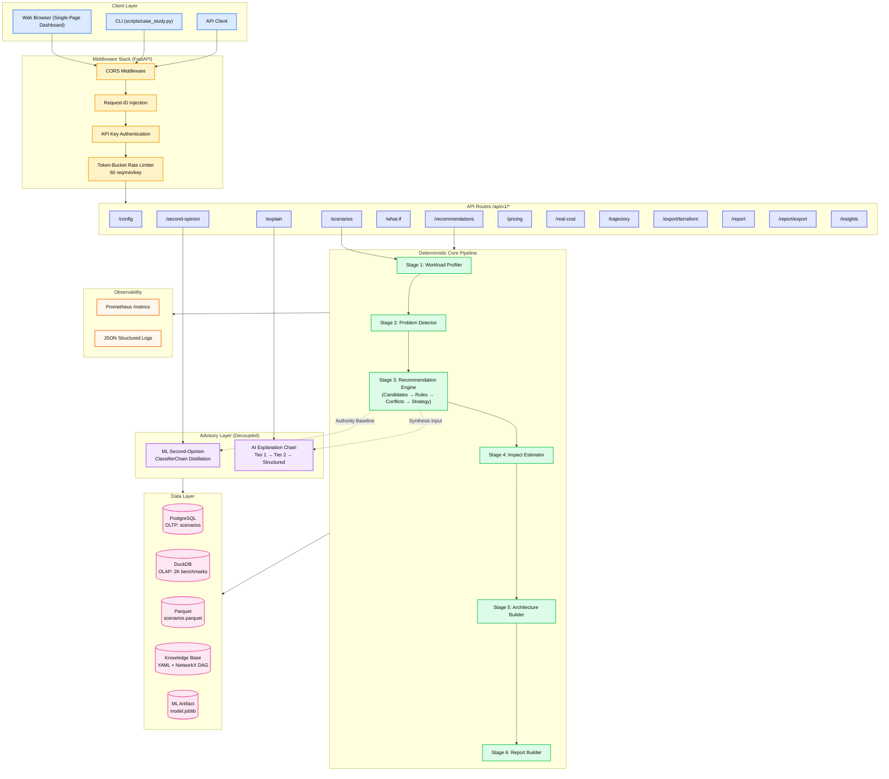
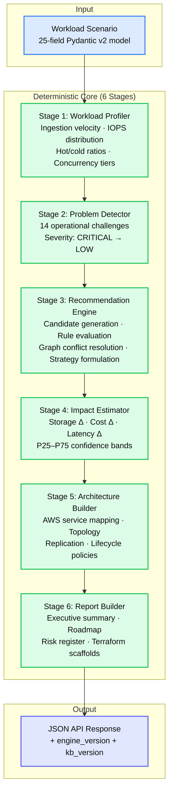
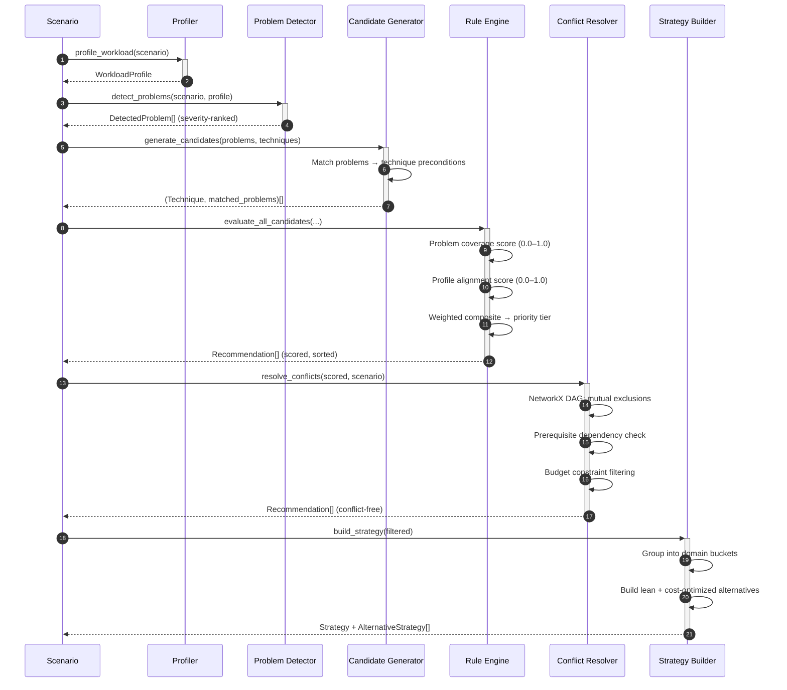
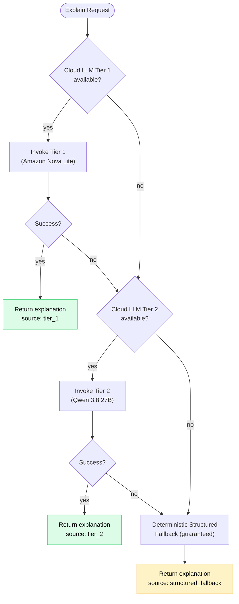
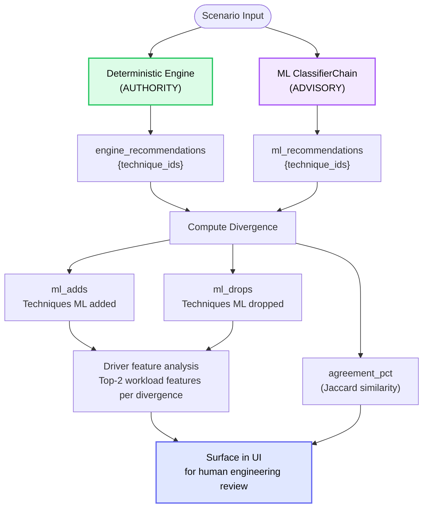
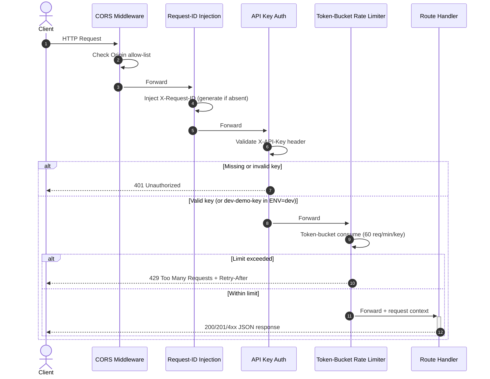
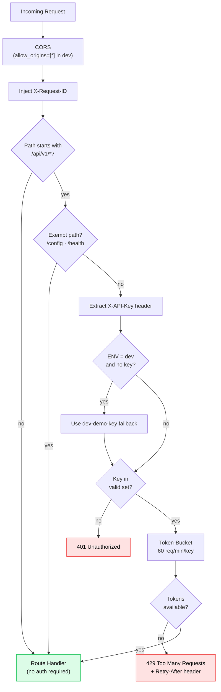
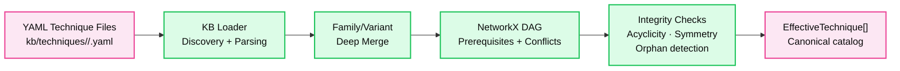
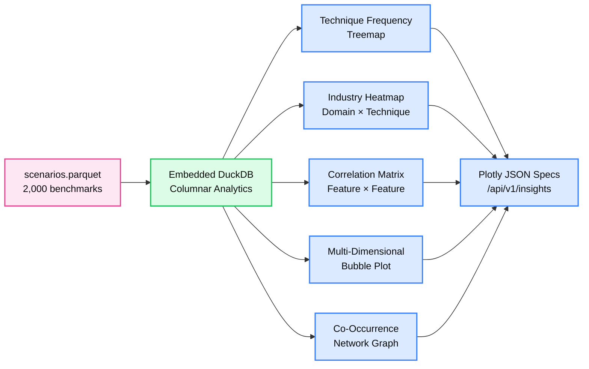
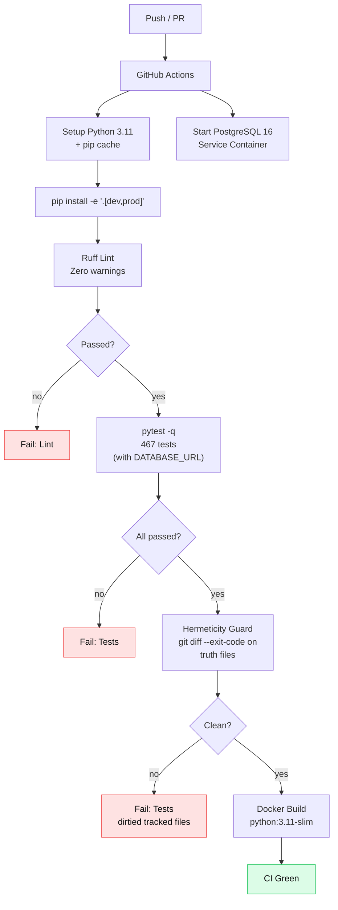

<div align="center">
  <h1>AI Data Architect</h1>
  <p>
    <b>Explainable, deterministic cloud storage architecture advisory for distributed systems engineering.</b>
  </p>
  <p><i>Rule Engine Authority · ML Second-Opinion · Quantitative Impact Modeling · Full Audit Trace</i></p>
  <p>
    <a href="https://github.com/simply-mihir/ai-storage">
      
    </a>
    <a href="https://github.com/simply-mihir/ai-storage/actions/workflows/ci.yml">
      
    </a>
    <a href="LICENSE">
      
    </a>
  </p>
  <p>
    
    
    
    
    
    
    
    
    
    
    
    
    
  </p>
</div>

---

**AI Data Architect** is an automated infrastructure advisory platform built around four architectural pillars:

1. **Deterministic Rule Engine** — every architectural decision is computed by an auditable, reproducible rules engine with full traceability from requirement to recommendation
2. **ML Second-Opinion** — a ClassifierChain distillation model provides an independent advisory verdict; disagreements flag cases for human review and never override the engine
3. **Quantitative Impact Modeling** — storage reduction, cost projections, and latency estimates are derived from explicit regression coefficients and AWS list-rate pricing
4. **Three-Tier AI Explanation** — a resilient fallback chain (cloud LLM tier 1 -> cloud LLM tier 2 -> deterministic structured engine) synthesizes natural-language rationale

The LLM **never** makes architectural decisions. The deterministic engine is the sole authority — always.

---

## Table of Contents

1. [Key Features](#1-key-features)
2. [System Architecture](#2-system-architecture)
3. [Flow Diagrams](#3-flow-diagrams)
   - 3.1 [Six-Stage Deterministic Pipeline](#31-six-stage-deterministic-pipeline)
   - 3.2 [Recommendation Engine Detail](#32-recommendation-engine-detail)
   - 3.3 [AI Explanation Fallback Chain](#33-ai-explanation-fallback-chain)
   - 3.4 [ML Second-Opinion Divergence Flow](#34-ml-second-opinion-divergence-flow)
   - 3.5 [Request Middleware Stack](#35-request-middleware-stack)
4. [API Reference](#5-api-reference)
5. [Security Architecture](#6-security-architecture)
6. [Knowledge Base & Technique Catalog](#7-knowledge-base--technique-catalog)
7. [Analytics & OLAP Engine](#8-analytics--olap-engine)
8. [CI/CD Workflow](#9-cicd-workflow)
9. [Quick Start — Local Development](#10-quick-start--local-development)
10. [Running Tests](#11-running-tests)
11. [Project Structure](#12-project-structure)
12. [Environment Configuration](#13-environment-configuration)
13. [Literature Validation](#14-literature-validation)
14. [Upgrading](#15-upgrading)
15. [License](#16-license)

---

## 1. Key Features

### Core Capabilities

| Feature | Description |
| :--- | :--- |
| **Workload Profiling** | Derives ingestion velocity, IOPS distribution, hot/cold data ratios, concurrency density, and recovery tolerance windows from a 25-field scenario specification. |
| **Problem Detection** | Maps workload profiles against 14 discrete operational challenges (`UNBOUNDED_OBJECT_GROWTH`, `HIGH_READ_LATENCY`, `RECOVERY_OBJECTIVE_VIOLATION`, etc.) with explicit severity rankings. |
| **Recommendation Engine** | Candidate generation, precondition evaluation, graph-based conflict resolution, and priority tiering (`REQUIRED`, `RECOMMENDED`, `OPTIONAL`, `AVOID`). |
| **Impact Estimation** | Model-based projections of storage reduction (GB/%), monthly cost savings (USD), and latency improvements with P25–P75 confidence bands from DuckDB historical analytics. |
| **Architecture Builder** | Translates approved techniques into AWS infrastructure components (S3, RDS PostgreSQL, ElastiCache Redis, Redshift, S3 Glacier) with topology and lifecycle policies. |
| **Real Cost Projection** | Itemized monthly cost breakdown using AWS list-rate pricing: S3 storage, data transfer, API tiers, RDS instances, gp3 baseline IOPS, and ElastiCache nodes. |
| **24-Month Growth Simulator** | Compound user growth and storage accumulation with automatic detection of architectural tipping points that trigger priority escalations. |
| **What-If Comparator** | Side-by-side delta analysis: added/dropped techniques, priority shifts, cost/latency deviations. |
| **ML Second-Opinion** | ClassifierChain logistic regression distillation model trained on 2,000 scenarios — advisory only, never overrides engine authority. |
| **AI Explanation Chain** | Three-tier resilient fallback: cloud LLM tier 1 -> cloud LLM tier 2 -> deterministic structured engine. Zero decisions delegated to generative models. |
| **Terraform Export** | Production-ready, modular HCL infrastructure scaffolds generated from the architecture output. |
| **Report Generation** | Consultant-grade report payload with executive summary, implementation roadmap, risk register, and Markdown/PDF export. |
| **Insights Dashboard** | Embedded DuckDB analytics over 2,000 historical scenario benchmarks with Plotly visualizations: treemaps, heatmaps, correlation matrices, bubble plots, network graphs. |
| **Prometheus Metrics** | In-memory collector exporting `requests_total`, `stage_duration_seconds` (p50/p90/p99), and `ai_fallback_tier` counters. |

### Engineering Depth

| Capability | Detail |
| :--- | :--- |
| **Zero-trust AI design** | LLM never decides — deterministic engine is the sole architectural authority |
| **Schema v1/v2 migration** | Transparent `upconvert_v1` seam; v1 payloads accepted and upconverted at the ingress boundary |
| **OLTP/OLAP separation** | PostgreSQL for transactional scenario metadata; embedded DuckDB for columnar analytics over Parquet |
| **Graceful degradation** | All core capabilities function offline with zero cloud credentials; PG record store returns `False`/`None` on failure |
| **Token-bucket rate limiting** | Thread-safe per-key rate limiter (60 req/min) with leak-refill mechanics |
| **API key authentication** | `X-API-Key` header validation; `dev-demo-key` fallback only when `ENV=dev` |
| **Request correlation** | `X-Request-ID` header injected and propagated across all five pipeline stages |
| **Structured JSON logging** | Per-stage timing with `timestamp`, `request_id`, `stage`, `duration_ms` — production log-aggregator ready |
| **Knowledge Base graph** | NetworkX DAG: acyclicity enforcement, variant inheritance merging, prerequisite dependency validation |
| **Golden-snapshot testing** | Reference workloads compared against committed golden outputs; any change requires explicit approval |
| **Test hermeticity** | CI guard step verifies `git diff --exit-code` on tracked truth files after `pytest` — tests never dirty the repo |
| **Frontend contract guard** | 13 pytest assertions ensuring required UI element IDs survive future commits |

---

## 2. System Architecture



```
┌─────────────────────────────────────────────────────────────────────────┐
│             Channels  (Web Dashboard · CLI · API Client)               │
├─────────────────────────────────────────────────────────────────────────┤
│                    Middleware Pipeline                                  │
│  CORS → Request-ID → API Key Auth → Token-Bucket Rate Limiter         │
├─────────────────────────────────────────────────────────────────────────┤
│                    FastAPI Routes  /api/v1/*                            │
│  /scenarios  /recommendations  /explain  /what-if  /second-opinion     │
│  /pricing  /real-cost  /trajectory  /export/terraform  /report         │
│  /report/export  /insights  /config                                    │
├─────────────────────────────────────────────────────────────────────────┤
│              Deterministic Core Pipeline (6 Stages)                    │
│  Profiling → Detection → Recommendation → Impact → Architecture →     │
│  Report Generation                                                     │
├─────────────────────────────────────────────────────────────────────────┤
│              Advisory Layer (Decoupled, Never Authoritative)           │
│  ML Second-Opinion (ClassifierChain)  │  AI Explanation Chain          │
├─────────────────────────────────────────────────────────────────────────┤
│                         Data Layer                                     │
│  PostgreSQL (OLTP)  │  DuckDB (OLAP)  │  Knowledge Base (YAML + DAG)  │
└─────────────────────────────────────────────────────────────────────────┘
```

---

## 3. Flow Diagrams

### 3.1 Six-Stage Deterministic Pipeline

Every recommendation request passes through an identical, reproducible pipeline.



---

### 3.2 Recommendation Engine Detail

Inside Stage 3: how candidates are discovered, scored, filtered, and grouped.



---

### 3.3 AI Explanation Fallback Chain

The explanation subsystem operates as a read-only synthesizer downstream of the deterministic engine.



---

### 3.4 ML Second-Opinion Divergence Flow

The ML model runs concurrently with the engine; divergences are surfaced but never acted upon.



---

### 3.5 Request Middleware Stack

Every inbound request passes this exact pipeline before reaching a route handler.



---

## 5. API Reference

### Recommendation Pipeline

| Method | Path | Auth | Description |
| :--- | :--- | :---: | :--- |
| `POST` | `/api/v1/scenarios` | Yes | Create a workload scenario and run validation |
| `POST` | `/api/v1/recommendations` | Yes | Run the full 6-stage recommendation pipeline |
| `POST` | `/api/v1/explain` | Yes | AI-synthesized architectural rationale (3-tier fallback) |
| `POST` | `/api/v1/what-if` | Yes | Compare two scenario variants side by side |
| `POST` | `/api/v1/second-opinion` | Yes | ML second-opinion advisory verdict |

### Pricing & Projection

| Method | Path | Auth | Description |
| :--- | :--- | :---: | :--- |
| `GET` | `/api/v1/pricing` | Yes | Live AWS list-rate pricing parameters |
| `POST` | `/api/v1/real-cost` | Yes | Itemized monthly cost projection with line items |
| `POST` | `/api/v1/trajectory` | Yes | 24-month growth and cost trajectory simulation |

### Export & Reporting

| Method | Path | Auth | Description |
| :--- | :--- | :---: | :--- |
| `POST` | `/api/v1/export/terraform` | Yes | Generate production Terraform (HCL) scaffold |
| `POST` | `/api/v1/report` | Yes | Build consultant-grade report payload |
| `GET` | `/api/v1/report/export` | Yes | Export report as Markdown or PDF (`?format=md\|pdf`) |

### Analytics & Configuration

| Method | Path | Auth | Description |
| :--- | :--- | :---: | :--- |
| `GET` | `/api/v1/insights` | Yes | Plotly JSON visualization specs from DuckDB analytics |
| `GET` | `/api/v1/config` | No | Client configuration (env, API key mode) |

### Health & Observability

| Method | Path | Description |
| :--- | :--- | :--- |
| `GET` | `/health` | Liveness probe (engine version, KB technique count, LLM availability, uptime) |
| `GET` | `/metrics` | Prometheus metrics export (requests_total, stage_duration, ai_fallback_tier) |

<details>
<summary><b>POST /api/v1/recommendations — request & response</b></summary>

**Request:**
```json
{
  "scenario": {
    "business_domain": "FINTECH",
    "company_size": "ENTERPRISE",
    "expected_users": 500000,
    "concurrent_users": 25000,
    "current_storage_gb": 10000.0,
    "daily_growth_gb": 50.0,
    "data_types": ["TRANSACTIONS", "LOGS"],
    "structured_data_pct": 80.0,
    "semi_structured_data_pct": 15.0,
    "unstructured_data_pct": 5.0,
    "read_intensity": "HIGH",
    "write_intensity": "MEDIUM",
    "access_pattern": "RANDOM",
    "latency_requirement_ms": 25.0,
    "availability_requirement": 99.99,
    "rto_minutes": 30.0,
    "rpo_minutes": 15.0,
    "retention_years": 7.0,
    "budget_level": "HIGH",
    "analytics_required": true,
    "real_time_processing_required": true,
    "sensitive_data": true,
    "encryption_required": true,
    "compliance_requirements": ["PCI_DSS", "SOC2"]
  }
}
```

**Response (200 OK):**
```json
{
  "scenario_id": "a1b2c3d4-...",
  "problems": [
    {
      "problem_id": "HIGH_READ_LATENCY",
      "severity": "HIGH",
      "evidence": "Latency requirement 25ms with HIGH read intensity"
    }
  ],
  "recommendations": [
    {
      "technique_id": "caching",
      "technique_name": "Distributed Caching Layer",
      "priority": "REQUIRED",
      "alignment_score": 0.92,
      "problems_solved": ["HIGH_READ_LATENCY"],
      "rationale": "...",
      "benefits": ["Sub-millisecond read latency", "Reduced database load"],
      "implementation_complexity": "MEDIUM"
    }
  ],
  "strategy": { "transactional": [...], "caching": [...], "analytics": [...] },
  "alternatives": [
    { "label": "Lean architecture", "focus": "Minimum viable — only required components" },
    { "label": "Cost-optimized", "focus": "Reduced complexity, lower operational spend" }
  ],
  "impact": {
    "storage": { "estimated_reduction_pct": 42.5 },
    "cost": { "estimated_savings_pct": 35.2 },
    "latency": { "estimated_optimized_latency_ms": 8.5 }
  },
  "architecture": { "services": [...], "connections": [...] },
  "engine_version": "1.0.0",
  "kb_version": "1.0.0",
  "generated_at": "2026-09-23T14:15:00Z"
}
```

</details>

<details>
<summary><b>POST /api/v1/second-opinion — ML advisory response</b></summary>

```json
{
  "agreement_pct": 85.7,
  "ml_adds": ["columnar_storage"],
  "ml_drops": ["data_pruning"],
  "reasons": {
    "columnar_storage": "Driven by analytics_required=True, structured_data_pct=80%",
    "data_pruning": "Driven by retention_years=7.0, budget_level=HIGH"
  },
  "divergences": [
    { "technique_id": "columnar_storage", "type": "add", "reason": "..." },
    { "technique_id": "data_pruning", "type": "drop", "reason": "..." }
  ],
  "engine_recommendations": ["caching", "partitioning", "replication", "data_pruning"],
  "ml_recommendations": ["caching", "partitioning", "replication", "columnar_storage"],
  "engine_authority": true,
  "role": "advisory"
}
```

</details>

---

## 6. Security Architecture



| Security Feature | Detail |
| :--- | :--- |
| API key authentication | `X-API-Key` header validated against `API_KEYS` env var (CSV) |
| Dev mode fallback | `dev-demo-key` accepted only when `ENV` is `dev`, `development`, `local`, or `test` |
| Token-bucket rate limiting | Thread-safe `TokenBucket` per API key; 60 tokens, 1 token/sec refill |
| Request correlation | `X-Request-ID` injected on every response; generated if absent from request |
| Global exception handler | Unhandled exceptions return `500` with `correlation_id`, never leak stack traces |
| CORS | Wildcard origins in dev; configurable for production |

---

## 7. Knowledge Base & Technique Catalog

The Knowledge Base is a hierarchical YAML catalog with NetworkX graph validation.



**Merge semantics (family + variant):**
- Dicts: deep-merge recursively (variant keys override; unset keys inherited)
- Scalars: variant overrides family (`None` = inherit)
- Lists: variant replaces family at any depth

**Graph validation:**
- Acyclicity enforcement — no circular prerequisite chains
- Relationship symmetry — if A conflicts with B, B must conflict with A
- Orphan detection — every referenced prerequisite must exist in the catalog
- Golden-snapshot tests — any change altering technique selection requires explicit approval

---

## 8. Analytics & OLAP Engine



The OLAP engine executes directly over compressed Parquet partitions — no external analytics infrastructure required. Sub-second query times for frequency distributions, correlation matrices, multi-technique co-occurrence itemsets, and confidence bands.

---

## 9. CI/CD Workflow



| Step | Detail |
| :--- | :--- |
| Python 3.11 | Pinned; pip cache keyed on `pyproject.toml` hash |
| PostgreSQL 16 | Service container with healthcheck; `DATABASE_URL` at job level |
| Ruff | Zero-tolerance; auto-fix off in CI |
| Pytest | 467 tests, `pytest -q`, SQLite fallback + live PG round-trip |
| Hermeticity guard | `git diff --exit-code` on `ml/model.joblib`, `warnings_snapshot.json`, `golden_provider_snapshot.json` |
| Docker | Single-stage: `python:3.11-slim` runtime |

---

## 10. Quick Start — Local Development

```bash
# Clone
git clone https://github.com/simply-mihir/ai-storage.git
cd ai-storage

# Virtual environment
python3 -m venv .venv && source .venv/bin/activate

# Install dependencies
pip install -e ".[dev,prod]"

# Copy env
cp .env.example .env
# Optionally edit .env with AWS credentials and LLM keys

# Start API
uvicorn storage_advisor.app.api:app --host 0.0.0.0 --port 8001
```

**Access points:**
- Dashboard -> [http://localhost:8001](http://localhost:8001)
- API docs -> [http://localhost:8001/docs](http://localhost:8001/docs)
- Health -> [http://localhost:8001/health](http://localhost:8001/health)
- Metrics -> [http://localhost:8001/metrics](http://localhost:8001/metrics)

### Docker Compose

```bash
docker compose up --build
```

Starts the FastAPI app on port 8001 and a PostgreSQL 16 instance on port 5432 with automatic healthcheck dependency.

```dockerfile
FROM python:3.11-slim
WORKDIR /app
COPY pyproject.toml .
COPY src/ src/
RUN pip install --no-cache-dir ".[prod]"
COPY static/ static/
COPY data/ data/
COPY ml/ ml/
EXPOSE 8001
CMD ["uvicorn", "storage_advisor.app.api:app", "--host", "0.0.0.0", "--port", "8001"]
```

---

## 11. Running Tests

```bash
# Full suite
pytest -q

# With coverage
pytest --cov=storage_advisor --cov-report=term-missing

# Case study benchmark
python scripts/case_study.py --workload all
```

All 467 tests execute in under 60 seconds. One test is skipped when `DATABASE_URL` is absent (PostgreSQL round-trip).

| Test Area | Coverage |
| :--- | :--- |
| Recommendation Pipeline | Profiling, detection, scoring, conflicts, strategy |
| Impact Estimation | Storage, cost, latency, confidence bands |
| API Endpoints | 200, 400, 401, 429, 500 status paths |
| Security | API key validation, rate limiter mechanics, dev mode gating |
| Knowledge Base | Graph acyclicity, inheritance merge, schema compliance |
| ML Second-Opinion | Holdout jaccard >= 0.80, feature columns, artifact structure |
| Analytics | DuckDB queries, Parquet export, EDA functions, Plotly charts |
| Pricing | AWS list-rate calculations, regional fallback, line items |
| Terraform | HCL generation, resource counts, component mapping |
| Reports | Markdown/PDF export, structured payload |
| Observability | Prometheus format, stage timing, request correlation |
| Frontend Contract | 13 UI element ID assertions |

---

## 12. Project Structure

```text
ai-storage/
├── .github/workflows/ci.yml           # Lint → Test → Hermeticity → Docker
├── src/storage_advisor/
│   ├── analytics/                      # OLAP queries, growth simulation, EDA
│   │   ├── charts.py                   # Plotly chart generators
│   │   ├── eda.py                      # DuckDB queries (frequency, correlation, co-occurrence)
│   │   ├── export_parquet.py           # Parquet partition exporter
│   │   ├── generator.py               # Calibrated synthetic scenario generator
│   │   ├── insights.py                 # Plotly figure assembly for /insights endpoint
│   │   ├── ml_experiment.py            # ML experiment tracking utilities
│   │   ├── store.py                    # Embedded DuckDB analytics repository
│   │   ├── trajectory.py              # 24-month growth simulation + tipping points
│   │   └── whatif.py                   # Side-by-side scenario comparison
│   ├── app/                            # FastAPI application + middleware
│   │   ├── api.py                      # 15 REST endpoints, request validation, stage instrumentation
│   │   └── security.py                 # API key auth, token-bucket rate limiter, dev gating
│   ├── architecture/
│   │   └── builder.py                  # Maps techniques → AWS components + topologies
│   ├── db/
│   │   └── record.py                   # PostgreSQL scenario persistence (graceful degradation)
│   ├── detection/
│   │   └── problem_detector.py         # 14 operational challenge detectors + severity ranking
│   ├── domain/                         # Core Pydantic v2 models
│   │   ├── problems.py                 # DetectedProblem, ProblemId, ProblemSeverity
│   │   ├── recommendations.py          # Recommendation, Strategy, AlternativeStrategy
│   │   ├── scenario.py                 # Canonical 25-field workload spec + upconvert_v1
│   │   └── techniques.py              # Technique model definition
│   ├── estimation/
│   │   ├── confidence.py               # P25–P75 percentile confidence bands
│   │   └── impact_estimator.py         # Storage/cost/latency regression coefficients
│   ├── export/
│   │   ├── story.py                    # Narrative export utilities
│   │   └── terraform.py               # HCL Terraform scaffold generator
│   ├── integrations/
│   │   ├── aws.py                      # AWS SDK client bindings + credential resolution
│   │   ├── bedrock.py                  # 3-tier LLM explanation chain + env alias shim
│   │   └── pricing.py                  # AWS Pricing API + regional fallback tables
│   ├── kb/                             # Knowledge Base v2 catalog engine
│   │   ├── loader.py                   # YAML discovery, inheritance merge, NetworkX graph
│   │   ├── schema.py                   # Family/Variant Pydantic models
│   │   ├── validate.py                 # Graph integrity (acyclicity, symmetry, orphans)
│   │   └── techniques/                # Hierarchical YAML technique definitions
│   ├── knowledge/
│   │   └── technique_catalog.py       # Technique loading and catalog API
│   ├── ml/
│   │   └── second_opinion.py          # Feature encoder, inference, driver feature analysis
│   ├── observability/
│   │   └── metrics.py                 # Prometheus collector (requests, stages, AI tier)
│   ├── profiling/
│   │   └── workload_profiler.py       # Workload profile derivation (pure functions)
│   ├── recommendation/
│   │   ├── candidate_generator.py     # Problem → technique matching
│   │   ├── conflict_resolver.py       # Graph-based conflict resolution
│   │   ├── recommendation_engine.py   # Full pipeline orchestrator
│   │   └── rule_engine.py             # Scoring, priority, evidence, rationale
│   └── reports/
│       ├── builder.py                 # Structured report payload construction
│       └── export.py                  # Markdown + PDF rendering
├── ml/
│   ├── model.joblib                   # Trained ClassifierChain weights
│   ├── features_v2.json              # Canonical 29-feature schema
│   └── README.md                     # Regeneration instructions
├── data/
│   └── synthetic/scenarios.parquet    # 2,000 benchmark scenarios
├── static/index.html                  # Single-page dashboard (8 tabs)
├── tests/                             # 467 tests across 30+ test files
├── scripts/
│   ├── case_study.py                  # Literature validation CLI
│   └── build_insights_ui.py          # Insights visualization builder
├── docker-compose.yml                 # App + PostgreSQL 16
├── Dockerfile                         # python:3.11-slim production image
├── pyproject.toml                     # Dependencies, dev/prod extras, ruff config
├── ARCHITECTURE.md                    # ADR register + module map
├── CASE_STUDY.md                     # Netflix/Uber validation study
└── DEMO.md                          # Live demo walkthrough script
```

---

## 13. Environment Configuration

The application degrades gracefully: all core recommendation, profiling, impact modeling, and analytical store capabilities function entirely offline with zero cloud credentials.

| Variable | Type | Default | Description |
| :--- | :--- | :--- | :--- |
| `API_KEYS` | String (CSV) | `dev-demo-key` | Comma-separated valid API keys for `/api/v1/*` routes |
| `ENV` | String | `dev` | Deployment mode (`dev`, `staging`, `prod`). `dev` enables demo key fallback; `prod` requires explicit keys |
| `AWS_REGION` | String | `us-east-1` | AWS region for live pricing and cloud integrations |
| `AWS_ACCESS_KEY_ID` | String | None | Optional credentials for cloud AI inference |
| `AWS_SECRET_ACCESS_KEY` | String | None | Optional credentials for cloud AI inference |
| `LLM_MODEL_ID` | String | `amazon.nova-lite-v1:0` | Model identifier for primary cloud LLM tier |
| `LLM_FALLBACK_KEY` | String | None | API key for secondary LLM fallback tier |
| `S3_BUCKET_NAME` | String | None | Optional S3 bucket for cloud storage integration |
| `DATABASE_URL` | String | None | PostgreSQL connection URI for system-of-record store. Omit for graceful offline degradation |
| `PORT` | Integer | `8001` | TCP port for the FastAPI web server |

---

## 14. Literature Validation

The engine was validated against real-world production architectures from Netflix and Uber.

| Case Study | Verified Techniques | Alignment |
| :--- | :--- | :--- |
| **Netflix** (media streaming) | Object storage, chunking, lifecycle management, caching, columnar storage, tiered archival, replication | 7/7 (100%) |
| **Uber** (event-sourced mobility) | Partitioning, indexing, sharding, caching, replication, compression, deduplication | 7/7 (100%) |

**Combined**: 14 of 14 techniques verified against published technical literature — 100% alignment.

Scenarios were encoded from Netflix TechBlog, Uber Engineering Blog, and peer-reviewed ACM/IEEE publications. The engine executed without human tuning or artificial overrides.

For detailed alignment tables, citation links, and divergence analysis, see [CASE_STUDY.md](CASE_STUDY.md).

---

## 15. Upgrading

The following environment variable names were renamed. The old names still work for one release and emit a `DeprecationWarning` at startup:

| Old Name | New Name |
| :--- | :--- |
| `BEDROCK_MODEL_ID` | `LLM_MODEL_ID` |
| `GROQ_API_KEY` | `LLM_FALLBACK_KEY` |

Update your `.env` and deployment configs before the next major release.

---

## 16. License

This project is licensed under the Apache License, Version 2.0. See the `LICENSE` file for details.

---

<div align="center">
  <sub>Built by <a href="https://github.com/simply-mihir">@simply-mihir</a> · Deterministic by design · Explainable by contract · Production-ready</sub>
</div>
